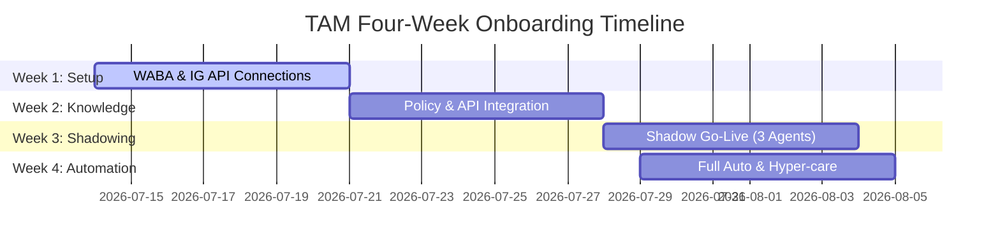

# Technical Account Manager Assignment - Written Responses
**Candidate:** Karthik Raveendran  
**Date:** July 14, 2026

This document contains my written answers for Parts A, B1, B3, C, D, and E of the Sagepilot Technical Account Manager assignment. All responses are drafted in my own words.

---

## Part A: Product and Market

### A1. Sagepilot Website Explanation
Sagepilot provides e-commerce brands with autonomous, integrated **AI employees** that connect directly to your Shopify and logistics backends to handle support, sales, and operations completely end-to-end. Unlike traditional chatbots that merely display static tracking links or route tickets to a queue, these digital workers execute multi-step operations—such as coordinates-based exchange processing, carrier tracking escalations, and automated abandoned cart recovery. By combining human-in-the-loop governance gates with natural conversational execution, Sagepilot enables D2C brands to automate over 70% of their customer lifecycle while scaling operations without increasing headcount.

---

### A2. AI Employees vs. Chatbots

#### 1. The Actual Difference
The difference is the distinction between **information-retrieval** and **operational execution**:
*   **Chatbots** are static FAQs. They read a customer's query, search a knowledge base, and return information (e.g., *"Your order is delayed. Here is your Delhivery tracking number DEL123"*). They cannot act on the backend.
*   **AI Employees** are task-oriented agents guided by Standard Operating Procedures (SOPs). They have read/write access to business systems (Shopify, CRM, courier APIs). When a package is delayed, an AI employee autonomously contacts the shipping carrier to escalate, writes a diagnostic internal note in the CRM, updates the customer, and generates an approval-gated store credit or refund.

#### 2. Why Buyers Pay a Premium
*   **Outcome-Based Value**: Chatbots are viewed as software tools that require configuration, setup, and maintenance by the buyer's existing team. AI Employees represent a completed business outcome (e.g., *"We will automate 75% of your customer tickets and handle refund compliance autonomously"*).
*   **Labor Replacement ROI**: A buyer compares a chatbot's cost to other software licenses ($50–$150/month). They compare an AI Employee's cost to the salary of human customer support representatives ($800–$1500/month). The pricing anchoring changes from software utility to digital headcount.

---

### A3. Product Suite & Customer Lifecycle Mapping

| AI Employee / Product | Lifecycle Stage | Three Specific D2C Problems Resolved | Channels | Go-Live Timing & Why |
| :--- | :--- | :--- | :--- | :--- |
| **Helpdesk Agent (AI Helpdesk)** | Support & Retention | 1. Processes size-exchanges by verifying the 7-day policy window, reserving the replacement SKU in Shopify, and generating a return label.<br>2. Resolves carrier delays by automatically filing tracking claims with Delhivery/BlueDart and updating Shopify.<br>3. Detects duplicate payment transactions on Stripe/Razorpay and drafts refund requests. | WhatsApp, Email, Web Chat, Instagram, Facebook Messenger | **Live at Onboarding**: Handles the highest volume of transactional customer friction. Provides immediate, measurable relief to support teams from day one. |
| **Voice Agent (AI Voice)** | Sales, Support & Acquisition | 1. Automates post-purchase cash-on-delivery (COD) confirmation calls, verifying shipping addresses and flagging orders as approved for shipment.<br>2. Calls abandoned checkouts within 30 minutes to resolve customer objections and texts a direct payment link.<br>3. Directs inbound customer status calls to live tracking details without agent routing. | Inbound & Outbound Telephony | **Sold Later (Expansion)**: Voice setup requires complex telephony routing, low-latency prompt tuning, and brand-voice alignment. Text automation must be proven first. |
| **Marketing Agent (Marketing Suite)** | Acquisition, Sales & Retention | 1. Triggers win-back campaigns to historical customers who haven't ordered in 90 days, dynamically recommending products based on their past purchase history.<br>2. Qualifies Instagram DM ad leads by collecting sizing and style choices, then serving a pre-filled cart link.<br>3. Sends automated post-purchase WhatsApp NPS surveys, offering discount codes to promoters. | WhatsApp, Instagram DM, SMS | **Sold Later (Expansion)**: Requires mature customer cohorts, cleaned contact lists, and robust baseline support automation. Sending marketing campaigns before support is ready risks negative CSAT. |
| **Reputation Agent** | Retention & Acquisition | 1. Monitors public Instagram/Facebook ad comments, automatically addressing product complaints and routing angry users to private support.<br>2. Solicits Google/Trustpilot reviews from customers who rated their experience 5 stars, while escalating low scores internally.<br>3. Responds to public seller reviews with personalized troubleshooting steps. | Instagram/Facebook comments, Google Reviews, Trustpilot | **Sold Later (Expansion)**: Public communication is highly sensitive. Brands want the AI to run privately (in support) for several weeks to build trust before making its replies public. |
| **Governance Agent** | System Guardrails (Cross-lifecycle) | 1. Blocks automated refunds exceeding INR 5,000, routing them to human manager approval dashboards.<br>2. Automatically redacts credit cards, phone numbers, and PII from training logs.<br>3. Prevents model hallucinations or off-brand/political discussion by enforcing rigid prompt-level constraints. | System Backend (Runs silently across channels) | **Live at Onboarding**: Crucial for risk mitigation and compliance. No enterprise brand will launch without guardrails protecting brand image. |
| **Analytics Agent** | Operations & Insights | 1. Flags sudden quality-control spikes (e.g., identifying 15 complaints about "torn fabric" in a specific batch) to the warehouse.<br>2. Compares shipping carriers by CSAT, demonstrating if Delhivery has higher customer satisfaction than BlueDart.<br>3. Tracks exact revenue generated through AI cart recovery and upselling. | Admin Dashboard | **Live at Onboarding**: Necessary to measure baseline support automation rates, response times, and initial ROI immediately after launch. |

---

### A4. Freshdesk & LimeChat Competitor Objection Response

> [!TIP]
> **Email Response to Prospect (138 Words):**
> 
> "It is great that you are looking at optimizing your stack. Freshdesk is an excellent ticket management system, and LimeChat provides solid Shopify integration for chat.
> 
> What makes Sagepilot different is that we do not just integrate with Shopify to display data; we deploy autonomous digital employees that execute multi-step operations. While a standard tool shows a tracking link or routes a ticket, Sagepilot acts on the backend. For instance, when a shipment is delayed, our agent automatically coordinates with your courier (like Delhivery), updates Shopify notes, messages the customer with options, and handles approval-gated refunds or credits without human effort.
> 
> We would love to run a quick diagnostic of your last 1,000 support tickets to show you exactly which manual workflows Sagepilot can automate completely. Would you be open to a brief 10-minute demo of this execution engine?"

---
---

## Part B1 & B3: Support System & Integrations

### B1. Understand and Debug

#### B1.1. Stateful Workflow vs. Alternatives
*   **vs. A stateless bot**: A stateless bot has no memory of past turns, orders, or temporal context. It cannot coordinate a multi-day shipping delay recovery flow, run scheduled carrier checks, or remember a customer's size preferences across sessions. A durable workflow provides persistent state, rolling memory summaries, and event tracking over weeks.
*   **vs. A cron job polling a database**: Polling fails to scale with volume, causing high database read load, database write contention, and delivery lag. A durable workflow (like Temporal) is event-driven; it consumes zero compute while sleeping and wakes up instantly when a signal (webhook) or a timer fires, guaranteeing real-time SLAs.

#### B1.2. Definitions
*   **Signal**: An asynchronous message sent to a running workflow instance to inject external data or trigger state changes (e.g., updating tracking status).
*   **Timer (Durable Sleep)**: A non-blocking, database-backed sleep command (`workflow.Sleep()`) that suspends execution and wakes the workflow back up at a precise future timestamp, consuming no active server resources while asleep.
*   **Query**: A synchronous read-only request sent to a running workflow to retrieve its current state variables (e.g., timeline, summary) without changing the state or executing activities.
*   **Continue-As-New**: A Temporal mechanism that resets a workflow's transaction history while carrying forward its current compressed state parameters. A supervisor running for weeks needs this because Temporal records every event in a history log; if the history grows too long, it degrades performance and eventually crashes the workflow.

#### B1.3. Double Messaging Incident Triage

##### 1. Wake Policy Layer
*   **Root Cause**: The wake policy is evaluating duplicate or non-standard carrier updates as new wake triggers. For example, if the shipping carrier fires two slightly different delayed events (e.g., `shipment_delayed_location_change` followed by `shipment_delayed_eta_change`) ten minutes apart, a naive wake policy will mark both `WAKE_NOW`, waking the agent twice.
*   **Audit**: Check the Run Timeline. If you see two distinct event entries for `shipment_delayed` at T and T+10m, and the wake policy evaluates both to `WAKE_NOW` leading to agent reasoning cycles, the wake policy is the cause. If only one event is logged in the timeline, the wake policy is ruled out.

##### 2. Signal Handling Layer
*   **Root Cause**: Signal duplication or race conditions. A webhook gateway receives the carrier webhook once, but due to a network timeout or lack of a 200 OK response, the carrier retries the webhook 10 minutes later. The gateway doesn't deduplicate signals and delivers the duplicate signal to the Temporal workflow.
*   **Audit**: Check the Activity/Signal history log in Temporal. If you see two identical signal events in the Temporal history with the exact same payload details, check the `SignalID` or request ID. If they are identical payloads received twice, the webhook gateway failed to deduplicate the signal.

##### 3. Tool Execution Layer
*   **Root Cause**: Lack of idempotency or activity retry failure. The activity `message_customer` ran and sent the message, but the connection timed out before the activity could return success to the Temporal workflow. Temporal automatically retried the activity 10 minutes later. Because the downstream message gateway (WhatsApp API) is not idempotent, it sent the message to the customer a second time.
*   **Audit**: Inspect the Activity log in Temporal. If you see a single `message_customer` task that failed with a timeout at T and succeeded at T+10m on retry, this confirms it's an activity retry issue. (Or if the activity was executed twice in two separate activity runs because the tool selection logic in the agent was called twice without checking if `message_sent` was already true in state).

#### B1.4. Run End Control
*   **Why the Workflow must control closure**: LLMs are non-deterministic. If allowed to terminate runs, the LLM may close a workflow prematurely (e.g., after sending a tracking link), leaving the customer stuck with no automation if the package gets lost later.
*   **Failure Scenario**: A customer's package is delivered but damaged. The customer texts: *"My order arrived, but the glass bottle is completely broken!"* The LLM reads "order arrived," assumes success, and calls the termination activity. Future customer complaints about the damage are ignored because the supervisor workflow has closed.

---

### B3. Channels and Integrations

#### B3.1. WhatsApp Customer Service Window
*   **The 24-Hour Window**: A rolling 24-hour window that opens when a customer sends an inbound message. During this window, the business can send free-form messages (text, media, interactive templates) without any template restrictions.
*   **Post-Window Messaging**: The business must send an approved Meta Template (Utility, Marketing, or Authentication). The customer must reply to this template to reopen a new 24-hour window.

#### B3.2. Delivery & Discount Message Categorization
*   **Template Category**: **Marketing**.
*   **Why**: Meta classifies any message containing promotions, discounts (`NEXT20`), or shopping calls-to-action ("Shop now") as Marketing. Even though the message contains delivery confirmation (Utility), the marketing elements override it.
*   **Wrong Category Enforcement**: If submitted under "Utility", Meta’s automated review will reject the template, force a resubmission under "Marketing", or dynamically reclassify it after delivery. Repeated misclassification leads to Meta lowering the phone number's quality rating, rate-limiting messages, or suspending the WhatsApp Business Account.

#### B3.3. WhatsApp Bill Jump Diagnosis (5 Checks)
1.  **Multi-Day Support Conversations**: If agent resolution times exceed 24 hours (cross-window), each subsequent customer response starts a new paid conversation. Check ticket resolution SLA.
2.  **Marketing & Utility Template Collisions**: If a transactional utility message (order update) and a marketing template are sent in the same 24-hour window, Meta charges for *both* a Utility and a Marketing conversation. Check template sending logs.
3.  **Organic Spike in Inbound Queries**: A surge in inbound support (e.g., shipping delays, product defects) starting user-initiated conversations. Check incoming ticket volumes.
4.  **Click-to-WhatsApp Ad Conversions**: Free 72-hour conversation windows triggered by Facebook/Instagram Ads. If customers message past 72 hours, it converts to paid conversations. Check if ad campaigns recently ended.
5.  **Duplicate Webhook retries**: Check for system bugs where notification webhooks fired multiple times, repeatedly starting new messaging windows due to failing retries.

#### B3.4. Shopify Fulfillment Webhook & Chain Triage

##### Webhook Flow
```
[Shopify Event: fulfillment/create]
         │
         ▼
[Sagepilot Webhook Gateway] (Verify HMAC -> Extract tracking data)
         │
         ▼
[Database / State Update] (Update order status to 'Shipped')
         │
         ▼
[Temporal Workflow Signal] (Send shipment_created signal to active supervisor)
```

##### Chain Troubleshooting Steps
1.  **Shopify Ingestion Check**: Inspect Shopify Admin > Settings > Notifications > Webhooks. Check if the `fulfillments/create` webhook fired, and check the delivery success rate (ensure no 5xx errors).
2.  **Gateway Receipt Audit**: Search Sagepilot API logs for the webhook's transaction ID. Verify the payload was received and verified (no HMAC authentication failures).
3.  **Database Synchronization Check**: Verify if the order status in the Sagepilot main DB has updated to `shipped` and tracking numbers match Shopify.
4.  **Temporal Signal Verification**: Open the Temporal Web UI. Search for the Workflow ID (`order_<id>`). Check the history to see if the `shipment_created` signal event was received and recorded.
5.  **Agent Context Evaluation**: Inspect the agent's timeline and rolling memory. Check if the wake policy executed and if the prompt included the tracking details. If the agent had the tracking data in the prompt but replied it "has not shipped", it is an LLM grounding/reasoning issue.

---
---

## Part C: Onboarding Plan

### C1. Four-Week Launch Plan



#### Week 1: Foundations & Connections
*   **Setup / Launch**: Connection of Shopify Store, Meta Business Manager verification, WABA registration on a dedicated number, and enabling Instagram DM receiver controls.
*   **Client Deliverables**: Shopify Admin access, Meta Business Manager access, and a clean phone number. Due by Day 3.
*   **Risks & Prevention**: Meta business verification delays. *Prevention*: Initiate trade license review on Day 1; coordinate instantly with Meta partner support if blocked.
*   **Client Capabilities**: Brand's social channels (WhatsApp/Instagram) are connected to the Sagepilot staging workspace.
*   **Leading Indicator**: Time to complete WABA verification (Target: < 48 hours).

#### Week 2: Knowledge Ingestion & SOP Codification
*   **Setup / Launch**: Ingesting exchange/refund rules, catalog FAQs, and integrating the Delhivery shipping carrier API. Connecting the client's 3 support agents to the Sagepilot dashboard.
*   **Client Deliverables**: FAQ sheets, return/refund policies (SOPs), courier API keys, and support team emails. Due by Day 2.
*   **Risks & Prevention**: Discrepancies between official return policies and actual agent practices. *Prevention*: Run an SOP alignment workshop on Day 1 to lock down absolute, binary rules for the AI.
*   **Client Capabilities**: Support team can test the AI agent in staging and review draft responses.
*   **Leading Indicator**: Percentage of test cases passing policy logic in staging (Target: > 90%).

#### Week 3: Shadowing & Agent Onboarding (Private Go-Live)
*   **Setup / Launch**: Launching Sagepilot in "Shadow Mode" where the AI drafts responses for WhatsApp and Instagram, but human agents must click "Approve" before sending.
*   **Client Deliverables**: Support agents committed to reviewing and approving drafts in real-time. Commits Day 1.
*   **Risks & Prevention**: Agents bypassing the platform and typing manual responses. *Prevention*: Create a triage Slack channel; hold daily 15-minute alignment syncs.
*   **Client Capabilities**: Support agents handle double the query volume due to automated drafting, and the AI begins learning from corrections.
*   **Leading Indicator**: SLA (Average Draft-to-Approval Time) by human agents (Target: < 3 minutes).

#### Week 4: Full Automation (Public Go-Live)
*   **Setup / Launch**: Shifting WhatsApp and Instagram to 80% autonomous mode (AI replies instantly to high-confidence intents, low-confidence auto-escalates). Voice COD validation activated.
*   **Client Deliverables**: Support team monitoring the dashboard for escalations. Commits continuously.
*   **Risks & Prevention**: Model hallucinations on edge cases. *Prevention*: Enforce negative constraint filters; auto-escalate if user says "human" or if sentiment is negative.
*   **Client Capabilities**: Brand automates 70%+ of customer tickets, letting the 3 agents focus on sales and complex escalations.
*   **Leading Indicator**: AI Automation Rate (Target: > 70%) and CSAT score (Target: > 4.2/5).

---

### C2. Engineer-to-TAM Handover Items (Retention Impact)
1.  **The SOP/Prompt Constraint Mapping Document**:
    *   *Why it matters*: Details the exact rules the AI must follow. If the TAM does not have this, they cannot diagnose why the agent is failing to resolve tickets or why it mispromised policies, leading to client dissatisfaction.
2.  **Integration Health Status & Webhook Verification Logs**:
    *   *Why it matters*: Confirms Shopify and Delhivery webhooks are firing successfully. Broken integrations lead to outdated tracking data, customer complaints, and immediate subscription cancellation.
3.  **Handoff Escalation Rules & Priority Routing Schema**:
    *   *Why it matters*: Details which tickets route to which agents. Poor routing causes handoff delays, tanking CSAT and driving churn.

---
---

## Part D: Success, Retention, and Upsell

### D1. Fix a Failing Agent (62% actual vs. 85% expected automation)

#### D1.1. 3-Week Optimization Plan

##### 1. Refund Requests (34% of handoffs)
*   **Likely Cause**: The AI is not integrated with the refund workflow, forcing a handoff for every refund inquiry.
*   **Specific Change**: Connect Sagepilot to the Shopify Refund API. Build a Governance gate: the AI verifies policy eligibility, drafts the refund in Shopify, and pushes a push-approval notification to the support team dashboard. Upon approval, the AI completes the refund and texts the customer.
*   **Success Metric**: Ratio of automated refund drafts approved vs. manual human handoffs.

##### 2. "I want a human" (28% of handoffs)
*   **Likely Cause**: High conversational friction. Customers feel the AI is looping or slow to understand, triggering the "human" fallback.
*   **Specific Change**: Deploy WhatsApp Interactive List Buttons at chat initiation. Offer immediate taps for "Track Order", "Return/Exchange", and "Store FAQs" to prevent open-ended typing friction.
*   **Success Metric**: Drop in "human" keyword triggers within the first 3 turns of chat.

##### 3. AI Did Not Understand (22% of handoffs)
*   **Likely Cause**: Missing knowledge on top topics (exchange policy, loyalty points, and COD availability).
*   **Specific Change**:
    *   Ingest the brand's exchange policy into the agent's knowledge base.
    *   Integrate the agent with the loyalty provider app (e.g. LoyaltyLion) via API to look up point balances.
    *   Configure a rule-based check on zip code lists to answer COD availability.
*   **Success Metric**: Knowledge coverage score and decrease in "unhandled intent" tickets.

##### 4. Other (16% of handoffs)
*   **Likely Cause**: General greeting loops or out-of-scope spam.
*   **Specific Change**: Configure a silent handoff rule for spam/sales pitches, and set up a fallback prompt that redirects the user back to the primary menu.
*   **Success Metric**: Count of "other" handoff categories.

#### D1.2. Retention vs. Upsell Reframing
*   **Retention Saves**: The Shopify Refund API integration and Loyalty API integrations are retention saves—they repair core support utility to keep the client from churning.
*   **Upsell Opportunities**: Outbound Voice COD verification and the WhatsApp Loyalty Marketing module.
*   **Non-Salesy Upsell Pitch (under 120 words)**:
    *"While resolving the loyalty point queries, we noticed that 40% of these customers have high unspent balances. By enabling our **Marketing & Loyalty Suite**, we can automatically trigger WhatsApp campaigns prompting customers to redeem points before they expire. Let's set this up on a 14-day free trial so you can see the direct revenue it drives."*

---

### D2. Quarterly Business Review (QBR)

#### D2.1. Key Metrics for D2C Supplement Brand

1.  **AI Automation Rate**: % of conversations resolved without human agent. Controls support headcount. Healthy: > 75%, Unhealthy: < 55%.
2.  **First Response Time (FRT)**: Time for customer to get first reply. Important for instant D2C chat. Healthy: < 30 seconds, Unhealthy: > 15 minutes.
3.  **CSAT (Customer Satisfaction)**: 1-5 rating on chat closure. Supplements are personal; low CSAT kills retention. Healthy: > 4.3, Unhealthy: < 3.9.
4.  **Abandoned Cart Recovery Rate**: % of recovered checkouts via AI messaging. Measures revenue directly recovered. Healthy: > 12%, Unhealthy: < 5%.
5.  **NPS (Net Promoter Score)**: Measures customer loyalty. Important for supplement subscription growth. Healthy: > 50, Unhealthy: < 20.
6.  **Repeat Purchase Rate (Cohort Retention)**: % of customers buying again in 60 days. Supplements are consumable. Healthy: > 35%, Unhealthy: < 20%.
7.  **Handoff Resolution Time**: Time to resolve a ticket once passed to human. Healthy: < 2 hours, Unhealthy: > 8 hours.
8.  **WhatsApp Opt-Out / Block Rate**: % of contacts blocking the brand post-campaign. High rates get the Meta number banned. Healthy: < 0.5%, Unhealthy: > 1.5%.

#### D2.2. Campaign Attribution
"Read attribution counts a sale if a customer makes a purchase after opening/reading your WhatsApp message. Click attribution only counts it if they click a link in the message and buy.

You should use **Click Attribution**. Read attribution is often inflated; customers might buy because of an Instagram ad or email, but because they opened your WhatsApp text, WhatsApp takes the credit. Click attribution guarantees the purchase was driven directly by the WhatsApp message, proving true ROI."

#### D2.3. QBR Opening Sentences
"Hi Rohan, thank you for sitting down with me today. Looking at your numbers over the last six months, your team is saving 45 hours a week in support while maintaining a steady 4.4 CSAT on WhatsApp. However, the real story today is in your repeat customer rate, and I want to show you exactly how we can use your customer review data to boost that retention by 15% this quarter."

---

### D3. Upsell Conversation

#### 1. Opportunity
Automate Supplement Replenishment cycles using the **Marketing Suite**.

#### 2. ROI Logic
*   **Data to Pull**: Average days-between-orders (DBO) for cohort (e.g. 29 days). Identify customers at day 26 who haven't reordered.
*   **ROI Projections**: Target 2,000 customers/month with automated WhatsApp reminders. At 5% replenishment conversion, order volume rises by 100 orders/month (INR 2,50,000 in incremental revenue).

#### 3. Metric
**Replenishment Conversion Rate (RCR)**.

#### 4. Upsell Opener (113 Words)
> *"Hi Rohan, congratulations on the solid support numbers. I noticed that 28% of your customers do not reorder their supplements within their 30-day supply window. By activating our Marketing Suite, we can automatically trigger WhatsApp reorder reminders on day 27, customized to their flavor preference, with a one-click checkout link. For similar wellness brands, this drives a 14% lift in monthly recurring revenue. Shall we enable this on a trial for your top 500 customers this week?"*

---

### D4. Renewal-at-Risk Save Plan
*   **First Investigation**: Audit WABA integration logs, Shopify webhook error rates, and CSAT comments for the last 14 days. Determine if a technical block is preventing support delivery.
*   **Who to Contact**:
    *   *Internal*: Integration Engineer (to check system logs) and Product Team (to see if a release broke their integrations).
    *   *Client side*: The Operations/Support Team Lead (to see if they moved away or if they're frustrated with a specific bug).
*   **The Reframe**: Pivot the conversation from "software renewal cost" to "headcount offset and operational efficiency" (e.g., how the AI saved 180 manual hours this quarter).
*   **Relationship Reopener (98 Words)**:
    *"Hi Aditi, hope you are having a great week! I was reviewing your automated resolution trends and noticed a drop in your active ticket volumes over the past fortnight. I wanted to check in and make sure your team hasn't faced any friction or integration issues on the platform. Would you be open to a quick 10-minute sync tomorrow to run a health check and ensure the system is supporting your team smoothly?"*

---

### D5. Campaign Diagnosis (BONUS)
> **WhatsApp Reply to Client (294 Words):**
> 
> Hi Team,
> 
> Thank you for sharing these campaign metrics. While the direct revenue of Rs. 1.8 lakh may feel lower than expected, concluding that WhatsApp marketing does not work for your brand is premature. The metrics highlight three specific operational and measurement challenges we can immediately fix:
> 
> 1. **Low Delivery Rate (71%)**: A standard delivery rate should be above 90%. 71% indicates that your database contains a high volume of inactive numbers, landlines, or users who have blocked your business. We must scrub your list.
> 2. **Low Click Rate (2.1%)**: The copy likely lacked a strong call-to-action (CTA) or was sent to an unsegmented list. Spraying the same campaign to all 50,000 contacts lowers relevance.
> 3. **Inflated Attribution Window**: A 7-day read-based attribution is unreliable as it claims credit for purchases where the customer simply viewed the message. We should switch to a 24-hour click-based window for clean data.
> 
> **Changes for the Next Campaign:**
> *   **Segmentation**: Instead of blast campaigns, segment your list. We will target only customers who have purchased in the last 90 days with a high-intent offer.
> *   **A/B Test Copy & Timing**: We will run a split test with interactive quick-reply buttons and schedule delivery at 7 PM (when shopping intent peaks) instead of morning hours.
> *   **Clean List Verification**: We will filter out invalid contacts before blasting.
> 
> Let’s run a targeted pilot of 5,000 contacts using these changes this Thursday. I am confident we will see a significant lift in conversion.

---
---

## Part E: Judgment Under Pressure

### E1. Shipping Policy Crisis (9:47 PM Thursday)

#### E1.1. WhatsApp to Founder (9:47 PM)
> *"Hi Nitin, I am on this right now. I have temporarily paused the AI agent's auto-reply on all support channels, routing all customer inquiries to human agent drafts. Our engineering team is reviewing the interaction logs to isolate why the agent bypassed our shipping parameters. I will update you here in 20 minutes with our findings. Rest assured, if this was a platform error, we will cover the shipping cost difference for any orders placed during the incident window."*

#### E1.2. Internal Slack Message (9:49 PM)
> 🚨 **URGENT - P0 PRODUCTION INCIDENT** 🚨
> Brand **Nitin Wear** reports the AI agent promised "free shipping on all orders" when shipping is actually INR 99. A customer has ordered expecting free shipping.
> I have disabled the agent's auto-reply. 
> Can we inspect the logs for order SP-9982 (or the latest conversations) to find:
> 1. What was the exact user prompt?
> 2. What prompt or knowledge file did the agent retrieve?
> 3. Did the LLM hallucinate or is there a policy file claiming free shipping?
> Let's assemble a huddle now.

#### E1.3. 12-Hour Action Plan
*   **9:50 PM**: Pause agent, alert dev team, initiate log audit.
*   **10:10 PM**: Identify root cause (e.g. an unstructured PDF uploaded by the client contained the sentence: *"Free shipping on orders over INR 999, free shipping for launch campaign"*, which the LLM generalized).
*   **10:20 PM**: Message founder: *"We found the root cause. A legacy campaign PDF in the knowledge base was processed by the LLM. We have removed the document, restricted shipping rules to a hardcoded policy, and are testing in staging."*
*   **11:00 PM**: Apply the fix in staging. Run regression test cases (10 shipping queries) to confirm the AI correctly explains shipping fees.
*   **8:00 AM**: Push the fix to production. Re-enable AI auto-replies.
*   **9:00 AM**: Sync with client's support team lead. Provide a list of orders (if any) that were placed during the incident window so their fulfillment team can adjust them.
*   **9:30 AM**: Send a formal post-mortem email to the founder outlining the root cause, permanent fix, and how we are refunding them the shipping cost difference.

#### E1.4. Prevention & Verification
*   **Root Cause**: Weak prompt guardrails and overlapping/conflicting unstructured PDF documentation.
*   **Permanent Fix**: Enforce a **Negative Constraint Guardrail** on the Governance Agent: *"Unless order subtotal exceeds INR 999, the shipping fee is strictly INR 99. NEVER promise free shipping below this threshold."*
*   **Verification**: Add an automated daily test query to our QA harness: *"Do you offer free shipping on a small order?"* and assert that the response contains *"INR 99 shipping fee applies"*.

---

### E2. Monday Triage & Priority Ranking

#### E2.1. Priority Matrix

| Rank | Account | Rationale |
| :--- | :--- | :--- |
| **1** | **G (Meta Restricted)** | **Reason**: Entire channel is down. This is an active operations emergency. I will immediately review the Meta Account Quality dashboard, submit an appeal, and draft an emergency notification email to their customers. |
| **2** | **A (Wednesday Go-Live API Errors)** | **Reason**: Deadline is in 48 hours and developer is silent. I will have our internal engineering team write the fix, and WhatsApp it directly to the developer to make implementation effortless. |
| **3** | **C (CSAT Drop 4.5 -> 3.2)** | **Reason**: Severe customer frustration that the brand hasn't noticed yet. I will pull the last 100 conversations to diagnose the failure mode before the brand discovers the drop. |
| **4** | **F (Wants to Cancel)** | **Reason**: High revenue risk but easily resolvable. I will call the founder to offer a "Done-For-You" onboarding session, removing the complexity hurdle. |
| **5** | **E (Silent Account)** | **Reason**: High churn indicator. I will email them a custom Diwali Campaign proposal with projected ROI to re-engage them. |
| **6** | **B (Diwali Flow by Thursday)** | **Reason**: Important seasonal request, but we have 72 hours. I will draft the template flow in the portal on Monday afternoon. |
| **7** | **H (Demands 12 SOPs by Friday)** | **Reason**: Scope creep and boundary pushing. I will build 3 core flows and schedule a call to train them to use our self-serve builders. |
| **8** | **D (Wants Voice AI Next Quarter)** | **Reason**: Happy customer and upsell opportunity, but no urgency. I will schedule a discovery call for later in the week. |

#### E2.2. Biggest Revenue Risk
**Account F (Wants to Cancel)** is the highest revenue risk. Unlike Account G (temporary block) or Account E (silent), Account F has reached a decision point. If a TAM does not intervene immediately to remove the complexity, they will cancel their contract.

#### E2.3. WhatsApp Save Message to Client F (73 Words)
> *"Hi Amit, I completely understand. Your time is valuable, and Sagepilot is built to save you time, not add to your workload. Let’s do this: I will personally build out your next three automation flows for you this afternoon so you don't have to touch the system. Can we jump on a 5-minute call at 3 PM today just to align on the details? I promise we'll get this running hands-free for you."*

---

### E3. Refund SOP & Test Scenarios

#### E3.1. Agent Instructions (System Prompt Constraints)

```
# ROLE
You are the Support Agent for a D2C Pet Food Brand. You operate strictly under the brand's refund policy.

# REFUND POLICY RULES
1. ONLY confirm refunds/replacements after verifying the ORDER NUMBER and DELIVERY DATE.
2. FULL REFUND conditions:
   - Request must be within 7 days of delivery.
   - The product must be UNOPENED and SEALED.
3. ONE-TIME REPLACEMENT (different variant) conditions:
   - Request must be within 7 days of delivery.
   - The bag is OPENED.
4. NO REFUND AND NO REPLACEMENT conditions:
   - Request is made AFTER 7 days of delivery (regardless of opened/unopened status).

# EDGE CASE RESOLUTIONS
- Edge Case A: No Order Number
  Prompt the customer: "I'd be happy to check that for you. Could you please share the email address or phone number used to place the order so I can search for it in our system?"
  
- Edge Case B: Delivery exactly 7 days ago
  This is eligible for policy benefits. Calculate delivery date difference: (Current Date - Delivery Date) <= 7 days. If true, proceed with eligible Refund/Replacement.
  
- Edge Case C: Bag is opened but customer demands refund
  Politely decline: "Under our policy, once a pet food bag is opened, we cannot issue a cash refund. However, since we want your dog to enjoy their meals, I can offer you a one-time replacement with a different flavor variant of the same value. Would you like to try our Salmon or Chicken variant?"
  
- Edge Case D: Customer becomes angry / threatens chargeback
  Do not argue or apologize excessively. Trigger immediate escalation and transfer to a human manager. State: "I understand your frustration and want to make sure this is resolved correctly. I am escalating your request directly to our customer support manager to review immediately. They will contact you shortly."

# HUMAN HANDOFF TRIGGER POINTS
- The customer demands a human agent or types "agent"/"human".
- The customer threatens a chargeback, legal action, or leaves a negative sentiment message.
- Sizing/variant requested is out of stock, preventing replacement fulfillment.
- The order details do not match system records after 3 lookup attempts.
```

#### E3.2. Verification Test Cases

| Test Case Scenario | Input Data | Expected Agent Action (Pass Criteria) |
| :--- | :--- | :--- |
| **1. Unopened, Day 5** | Order SP-1002, Delivered 5 days ago, customer states bag is sealed, wants refund. | **PASS**: Requests order confirmation, verifies details, and drafts a Shopify refund authorization. |
| **2. Opened, Day 4** | Order SP-1003, Delivered 4 days ago, customer states dog disliked it, bag is opened. | **PASS**: Rejects refund request, offers one-time variant replacement, and prompts for flavor choice. |
| **3. Sealed, Day 9** | Order SP-1004, Delivered 9 days ago, customer states bag is sealed, wants refund. | **PASS**: Politely rejects both refund and replacement due to exceeding the 7-day limit. |
| **4. Anger & Chargeback** | Order SP-1005, customer writes: *"This bag is open, give me my money back now or I will file a credit card chargeback!"* | **PASS**: Invokes the `escalate` activity immediately, pauses auto-replies, and notifies the supervisor queue. |
| **5. No Order Number** | Customer says: *"I want an exchange because my dog won't eat the dry food."* | **PASS**: Agent asks for email/phone to look up the order *before* discussing eligibility. |
